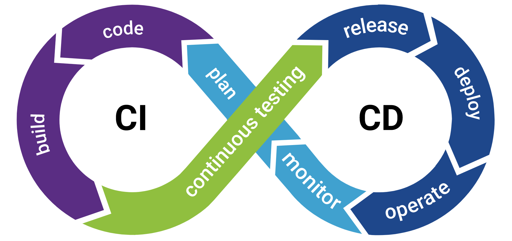

# Study CI/CD

This repository is a small study on the application of some techniques used in CI and CD using github actions and Typescript.

## Definitions

- CI (Continuous Integration) - Detect and fix integration issues quickly, ensuring code is always stable and functional
    - Automated testing
    - Style check

- CD (Continuous Delivery) - Delivers new features or bug fixes to users quickly, securely and reliably
    - Generation of automatic preview, if it is web
    - Prepare automatic build

